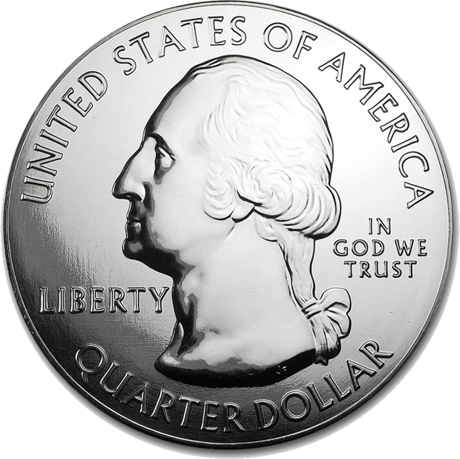

In this article, we will explore an experiment in statistics and probability. The experiment is described in David Spiegelhalter's [The Art of Statistics](https://www.amazon.com/Art-Statistics-How-Learn-Data/dp/1541618513) and is meant to provide an example of how our intuitions about probability can sometimes mislead us.
If you have the book, you'll notice that the original problem involves 3 coins, but we will reduce it to 2 coins because it doesn't change the character of the problem.



## The Question

---

### Description

Suppose you have a pouch with 2 coins in it. One coin is a fair coin with heads on one side and tails on the other side. The other coin is different, though. Both of its faces are heads.
You unzip the pouch and randomly choose one of the coins and set it on the table. You observe the face of the coin. Now the question is...

<i>
  What is the probability that if you see heads on the table, the other side
  will be heads when you flip it?
</i>

(Take a second to think about it and come up with your own answer.)

### Theory

If you gave it a good try, you may have reasoned something like this:

- If I see heads, I'm either holding the fair coin or the unfair coin.
- Since I'm equally likely to draw each coin, flipping it will reveal tails if I'm holding the fair coin and heads if I'm holding the unfair coin.
- Therefore, the probablity that the other side is heads is 50%.

This is the intuitive but incorrect answer that Spiegelhalter expects the reader of the Art of Statistics to come up with. But don't worry, many people (including myself the first time I read it) get it wrong, but now we can work out the answer with some good old probability theory and a Python program (if you're here for it).
First, we can draw upon a formula for conditional probability.

$$
P(A | B) = \frac{P(\text{A } \cap \text{ B})}{P(B)}
$$

This states that the probability of event A happening given that event B happened is equal to the probability of event A happening **and** event B happening **divided by** the probability of event B happening.
Ok, so how do we apply this formula to the coin experiment? Let's define Event A to be that the other side is heads when we flip it. Event B can be when we first observe the coin's face on the table. So if we substitute this back into the conditional probability formula, we have...

$$
P(\text{other side is heads | you saw heads}) = \frac{P(\text{other side is heads } \cap \text{ you saw heads})}{P(\text{you saw heads})}
$$

Lucky for us, we can break down every scenario into a neat table.

| Case | Coin   | What You See on the Table | Action | What is on the Other Side |
| ---- | ------ | ------------------------- | ------ | ------------------------- |
| 1    | Fair   | Tails                     | Flip   | Heads                     |
| 2    | Fair   | Heads                     | Flip   | Tails                     |
| 3    | Unfair | Heads                     | Flip   | Heads                     |
| 4    | Unfair | Heads                     | Flip   | Heads                     |

From the table, we can tell the following:

$$
P(\text{drawing the fair coin}) = \frac{1}{2} \\
P(\text{drawing the unfair coin}) = \frac{1}{2} \\
P(\text{other side is heads } \cap \text{ you saw heads}) = \frac{1}{2} \\
P(\text{you saw heads}) = \frac{3}{4} \\
\\
P(\text{other side is heads | you saw heads}) = \frac{(\frac{1}{2})}{(\frac{3}{4})} = \frac{2}{3}
$$

So if the answer you came up with was 1/2 or a probability of 0.5, you can at least claim that you got it half-right: you got the numerator in the conditional probability expression. If you're skeptical of the calculation, remember that the probability of drawing either coin remains 1/2 and that "admission" does not disprove the calculation above. It is a fact that is <i>relied upon</i> by the answer. And if this table is insufficient in convincing you of the answer being 2/3, one thing you could do is to run the experiment yourself. Run enough trials and the actual frequency of the other side being heads will approach the theoretical frequency. However, that approach is very tedious. Another approach would be to write a program that simulates the experiment exactly. So that's what we will do here.

## The Code

---

Let's define a class to represent a coin.

### Coin

```python
# We can put this at the top of the file
from random import sample, choice

...

class Coin:
    # Let's define a coin with an array of sides (single character 'H' or 'T')
    def __init__(self, sides):
        self.sides = sides

    # Get 2 random sides from the coin:
    # Index 0: the side facing up when we draw it
    # Index 1: the next side when we flip it
    def look_and_flip(self):
        number_of_sides = len(self.sides)
        random_side_index = randint(0, number_of_sides - 1)
        # The next side is determined by the one we drew, not random
        next_side_index = (random_side_index + 1) % number_of_sides
        return [self.sides[random_side_index], self.sides[next_side_index]]

```

### Bag of Coins

Continuing with the object-oriented route, let's define a coin bag.

```python
class BagOfCoins:
    def __init__(self, number_of_fair_coins, number_of_unfair_coins):
        # The pocket is an array of coins.
        self.pocket = []
        for _ in range(number_of_fair_coins):
            # Since we randomly get the index, order does not matter
            fair_coin = Coin(sides=['H', 'T'])
            self.pocket.append(fair_coin)
        for _ in range(number_of_unfair_coins):
            unfair_coin = Coin(sides=['H', 'H'])
            self.pocket.append(unfair_coin)

    def reach_into_bag_and_grab_coin(self):
        return choice(self.pocket)
```

### Running the Experiment

Then we can use these object blueprints to run the experiment and collect stats.

```python
...
bag = BagOfCoins(fair_coins=1, unfair_coins=1)
number_of_heads_then_heads = 0
iterations = 10000 # Arbitrarily large number of iterations
while iterations > 0:
    random_coin = bag.reach_into_bag_and_grab_coin()
    side_shown, flipped_side = random_coin.look_and_flip()
    if side_shown == 'H': # We MUST observe Heads first
        iterations -= 1
        if flipped_side == 'H':
            number_of_heads_then_heads += 1

print("P(A | B): ", number_of_heads_then_heads / iterations)
```

As you increase the number of iterations, you will notice the number printed at the end approaching 0.66 or 2/3.

## What Next?

---

### Number of Sides

As you may have noticed from the way the Coin class is defined, we could recognize this experiment as an instance of a more general problem. This case is the "Unfair Coin Experiment" where the number of coin sides is equal to 2. You could even modify the Python program that you just wrote to run the experiment where the number of sides on a coin is <i>N</i> (e.g. N = 50, N = 100). At this point, you could represent the sides of a coin to be numbers (Heads becomes 0, Tails becomes 1, ..., 2, 3, 4, ... , N - 2, N - 1 , N) and then ask a similar question like: Given that you see heads (again, heads is now represented by 0), what is the probability that the next side you see when you rotate it is heads?

### Nested Coin Bags

Not only could we extend the number of sides to each "coin", but we could also reach into a "super" bag full of <i>coin bags</i>, or a "mega" bag full of "super" bags, and so on...
As long as we randomly choose between 2 subbags, we can nest this as much as we want and the character of the problem does not change.

### Wrapup

In both of these cases, all we need to do is write our Python experiment carefully and apply conditional probability in order to answer the types of questions that Spiegelhalter posed in his book. Hope you enjoyed the article and found it insightful.
