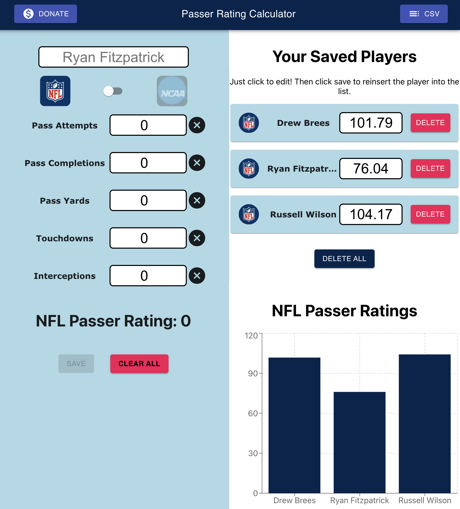
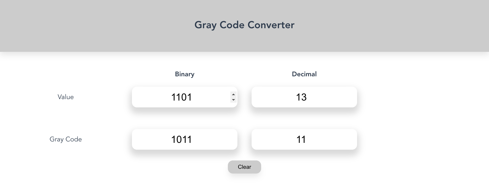
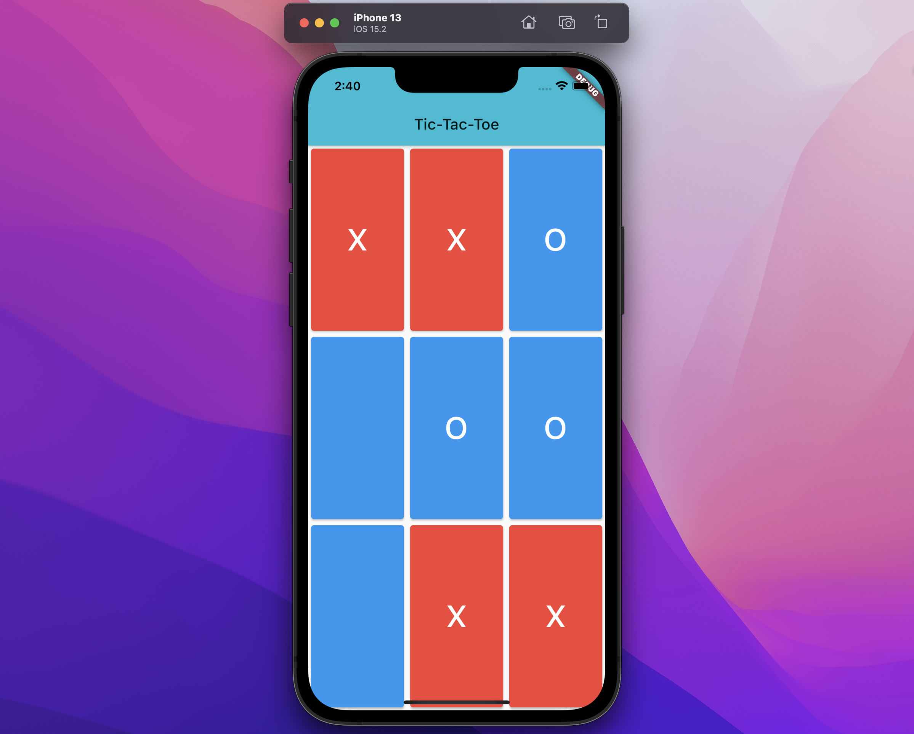

## Work Experience

---

### Oracle Cloud Infrastructure

#### Frontend Developer (April 2022 - Present)

### [Tennibot](https://www.tennibot.com)

#### Software Developer (May 2020 - March 2022)

- Developed, tested, and released the cross-platform Tennibot app in React Native.
- Worked on a small team in building the Har-Tru HyQ Court app with Firebase and Expo.
- Created and maintained tennibot.com.

### [OCV LLC](https://www.myocv.com)

#### Web Developer (September 2019 - May 2020)

- Built an internal React app using the Serverless framework for integrating with other software vendors and interacting with AWS S3.
- Developed a couple of Python scripts that automated Google Drive tasks.
- Refactored an existing React component library written in TypeScript.

### [ARMS](https://www.arms.com)

#### Project Support Technician (Summer 2019)

- Documented support cases for ARMS (Automated Records Management System) clients, precisely formulating software behaviors.
- Collaborated with other support technicians to answer questions and address extraordinary behaviors.
- Wrote technical documentation and FAQs for clients accessing the company support site.
- Connected remotely with customers to walk through software features, diagnose errors, run scripts, create views
- Studied databases fundamentals (SQL) in order to understand the underlying relational database system.

## Independent Projects

---

### [Recipe Pods](https://recipepods.com)

---

#### Description

- Desktop-only MVP for creating and sharing recipes

#### Stack

- Next.js
- Firebase
- CSS Modules

### [Passer Rating](https://www.passer-rating.com/)

---

#### Description

- Calculate and compare NCAA anad NFL QB passer ratings

#### Stack

- Create React App
- Material UI

### Africa

---

#### Description

- African animal explorer from the SwiftUI Masterclass

#### Stack

- SwiftUI
- JSON Documents

### [Gray Code Converter](https://www.graycodeconverter.com/)

---

#### Description

- Free web utility for converting binary and decimals to the gray code number system

#### Stack

- Vue.js
- CSS

### [Tic-Tac-Toe](https://github.com/patrickspafford/tic-tac-toe)

---

#### Description

- Cross-platform mobile / web app for playing the game we all know so well.

#### Stack

- Flutter

### This Site

---

#### Description

- Not built with Docusaurus.

#### Stack

- Gatsby.js
- TailwindCSS
- FaunaDB
- MDX

## Education

---

### Auburn University

#### Bachelor's of Science (2018 - 2021)

Computer Science (GPA: 3.91)

## Certifications

---

- [London App Brewery iOS Course](https://www.udemy.com/course/ios-13-app-development-bootcamp/?referralCode=D3530B180A3ECABC6056%22)
- Microsoft Azure Fundamentals
- MTA Software Development Fundamentals
- MTA Database Fundamentals
